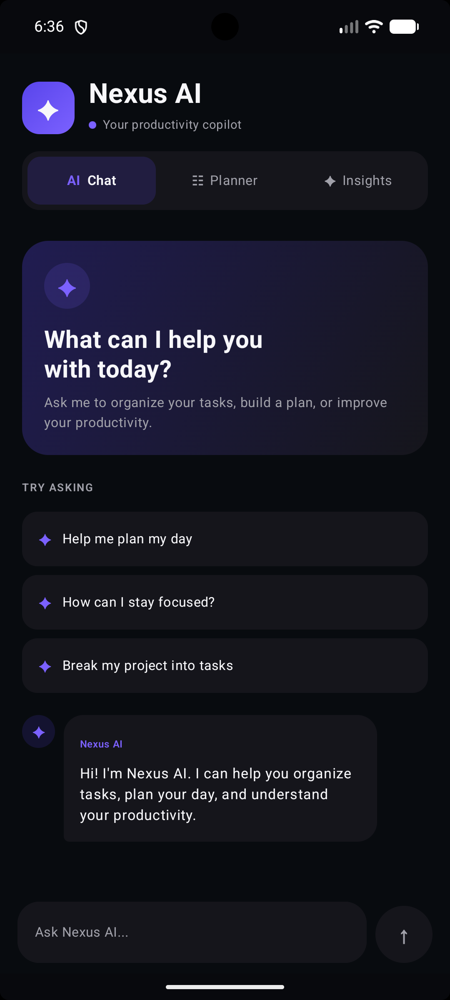
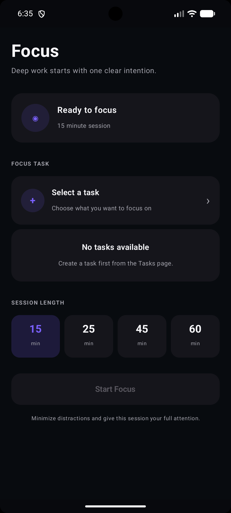

# NEXUS

NEXUS is an AI-powered productivity Android application designed to help users organize tasks, manage focus sessions, and get intelligent productivity assistance.

## Features

- 🔐 User registration and login
- 📝 Personal task management
- ✅ Task completion tracking
- 🎯 Focus session / productivity timer
- 🤖 AI Chat assistant
- 📅 AI Planner for generating task plans
- 📊 AI Insights for productivity analysis
- 👤 User profile
- 💾 Local data persistence with Room
- 🌐 FastAPI backend with PostgreSQL
- 👥 Account-based user data

## Tech Stack

### Android

- Kotlin
- Jetpack Compose
- Material 3
- Navigation Compose
- ViewModel
- Room Database
- Retrofit
- OkHttp
- Gson

### Backend

- Python
- FastAPI
- SQLAlchemy
- PostgreSQL
- Uvicorn

### AI

- Ollama
- Qwen3 8B

## Architecture

```text
Android App
    │
    ├── Jetpack Compose UI
    ├── ViewModel
    ├── Room Database
    │
    └── Retrofit
            │
            ▼
        FastAPI Backend
            │
            ├── Authentication
            ├── Tasks
            ├── AI Chat
            ├── AI Planner
            └── AI Insights
                    │
                    ▼
              Ollama / Qwen3

```

## Tampilan Aplikasi

### AI Chat



### Focus

